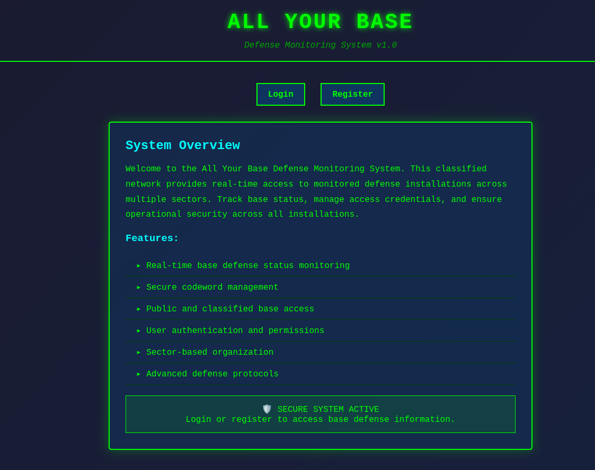
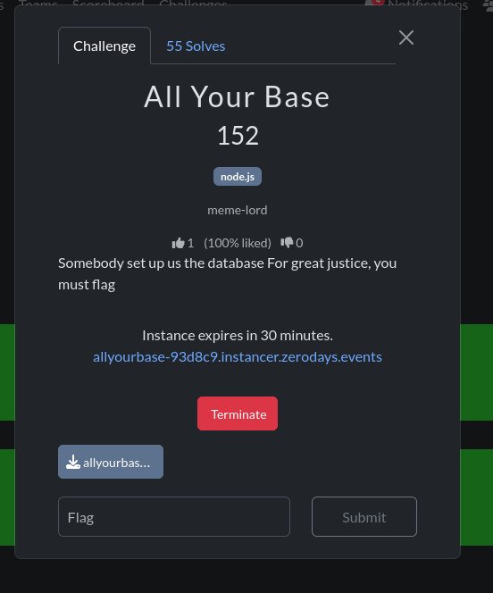
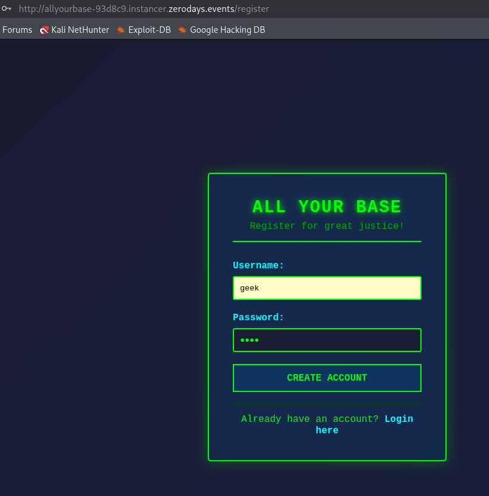
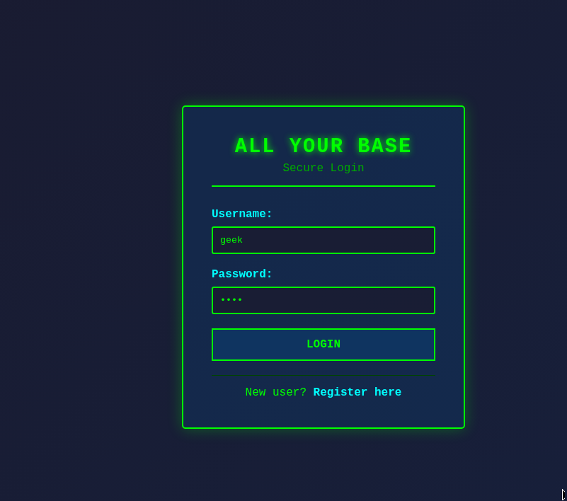
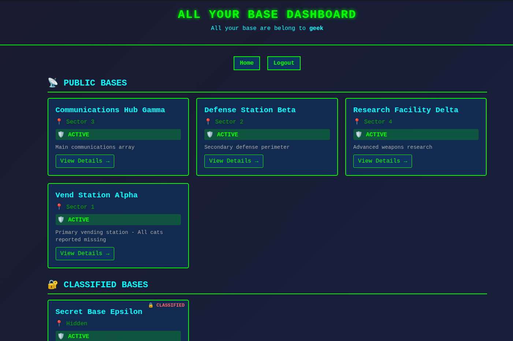

# CTF Write-up — **All Your Base**

*Somebody set up us the database.*

---

## Summary

**All Your Base** is a web challenge built with **Node.js / Express**, **SQLite** (in-memory), and **Passport** (local auth). The goal is to recover a flag stored as the **`codeword`** of a private military base. The intended path is a **SQL injection** on the authenticated endpoint **`GET /search`**, where the query parameter `q` is concatenated into raw SQL.

---

## Reconnaissance

The app exposes a landing page with **Login** and **Register**, then a **Dashboard** listing public and classified bases. The flag is not visible in the UI; you must abuse the search API.

**Fig. 1 — Application landing page.**



**Fig. 2 — Challenge / platform context (e.g. instance description).**



---

## Account setup

Create any user, log in, and confirm the session (cookie **`connect.sid`**) before calling **`/search`**.

**Fig. 3 — Registration.**



**Fig. 4 — Login.**



**Fig. 5 — Dashboard (public + classified sections; no flag in the UI).**



---

## Vulnerability — SQL injection on `/search`

The `/search` route builds SQL with a **template literal**, inserting `q` directly into the `LIKE` clause. User input is **not** passed as a bound parameter, so the query can be broken and extended (e.g. with `UNION`).

```191:197:/home/kali/ctf/thm/zeodayctf/allbase/app.js
app.get('/search', isAuthenticated, (req, res) => {
  const q = req.query.q || '';
  db.all(`SELECT name, description FROM bases WHERE name LIKE '%${q}%'`, [], (err, rows) => {
    if (err) return res.status(500).json({ error: 'Internal server error' });
    res.json(rows);
  });
});
```

The handler returns **JSON**: `[{ "name": "...", "description": "..." }, ...]`. The first column of a `UNION` must match that shape; placing **`codeword`** in the first selected column surfaces the flag under the **`name`** field.

**Conditions:** must be **authenticated** (`isAuthenticated`).  
**Engine:** **SQLite** (payload syntax below).

---

## Exploitation

1. Register and log in (session cookie required).  
2. Send **`GET /search`** with parameter **`q`** containing a **`UNION`** that selects **`codeword`** and **`description`** from **`bases`** where **`is_private=1`**, and terminate the original query with **`--`** (with a trailing space so the rest of the server-generated fragment is commented out).

**Payload (logical value of `q`):**

```sql
' UNION SELECT codeword, description FROM bases WHERE is_private=1 -- 
```

**Burp Suite:** use **`GET /search HTTP/1.1`** and set **`q`** under **Params** (URL-encoded automatically), or paste a fully URL-encoded request line in **Raw** — raw spaces and quotes in the first line without encoding often yield **400 Bad Request**.

**Fig. 6 — Proxy / Target history (traffic to the app).**


**Fig. 7 — Repeater: request to `/search` and JSON response with the flag in `name`.**


### Or:

```bash
GET /search?q=%27%20UNION%20SELECT%20codeword%2C%20description%20FROM%20bases%20WHERE%20is_private%3D1%20--%20 HTTP/1.1
```

---

## Flag

```
zerodays{...}
```


---

## Reference

*“All your base are belong to us”* — *Zero Wing*.
