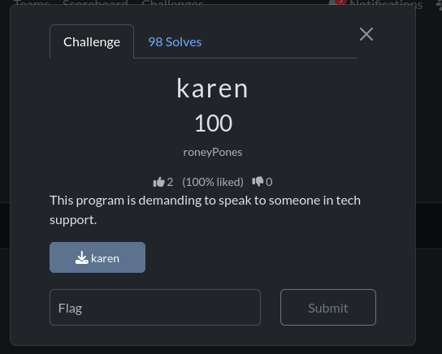
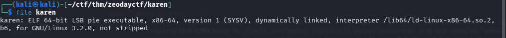
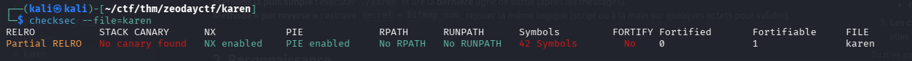
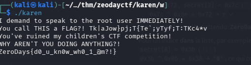

# Karen — brief write-up (Zero Days )

**Category:** reverse engineering (ELF64 Linux) · **Binary:** `karen`  


---

## Challenge context



---

## Quick steps

### 1. Identify the binary

```bash
file karen
```



### 2. Check protections (optional)

```bash
checksec --file=./karen
```



### 3. Run it

No user input. The program first prints a **fake** flag line (`printf` of the raw `secret` buffer), then the **real** flag after `transform()`.

```bash
chmod +x karen
./karen
```



**Takeaway:** do not stop at `You call THIS a FLAG?! …` — submit the **last** line only.


