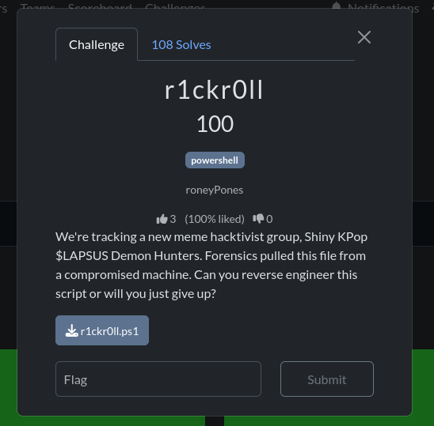
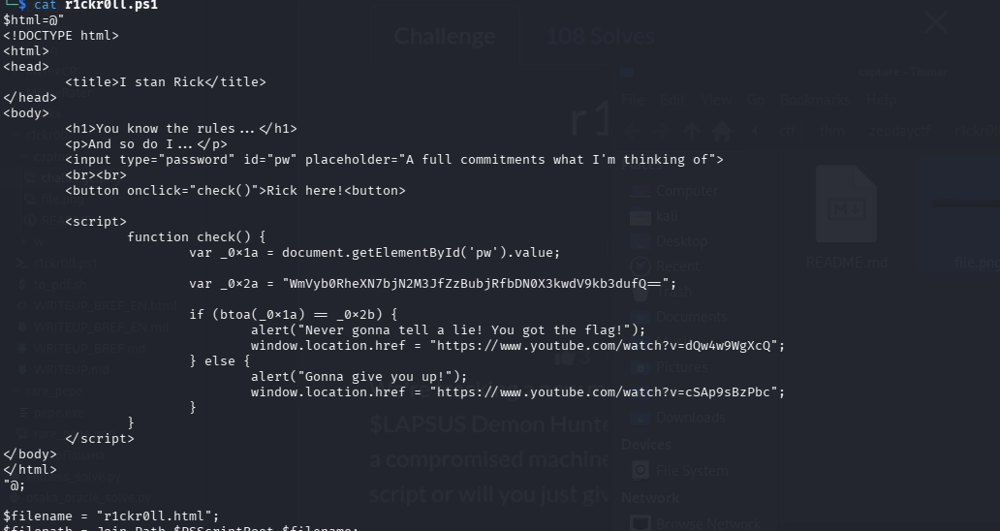
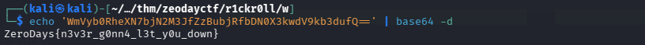

# r1ckr0ll — brief write-up (Zero Days / THM)

**Category:** forensics / reverse (PowerShell + embedded HTML/JS)  
**File:** `r1ckr0ll.ps1`  


---

## Challenge context



---

## Quick steps

### 1. Inspect the script

The page is a PowerShell here-string. Find the **Base64** string in `_0x2a` and the check `btoa(_0x1a) == _0x2b`.



### 2. Browser trap

`_0x2b` is **never defined** → the `if` is always false; the password form cannot succeed. Don’t chase the Rick Roll in the browser.

### 3. Decode Base64

The flag is in **`_0x2a`** — decode as-is:

```bash
echo 'WmVyb0RheXN7bjN2M3JfZzBubjRfbDN0X3kwdV9kb3dufQ==' | base64 -d
```



---

## One-liner

Broken JS compare (`_0x2a` vs `_0x2b`): decode the Base64 constant offline.


